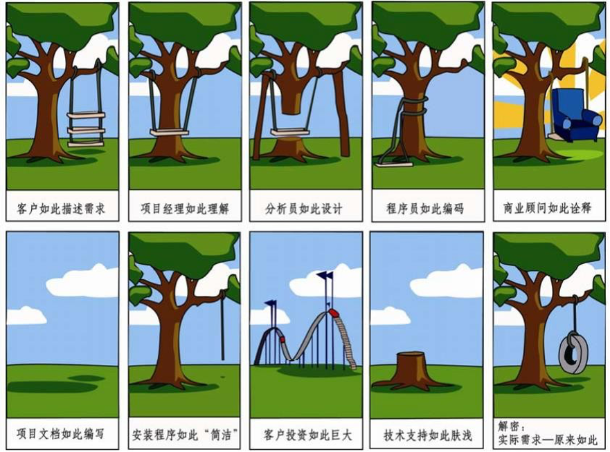
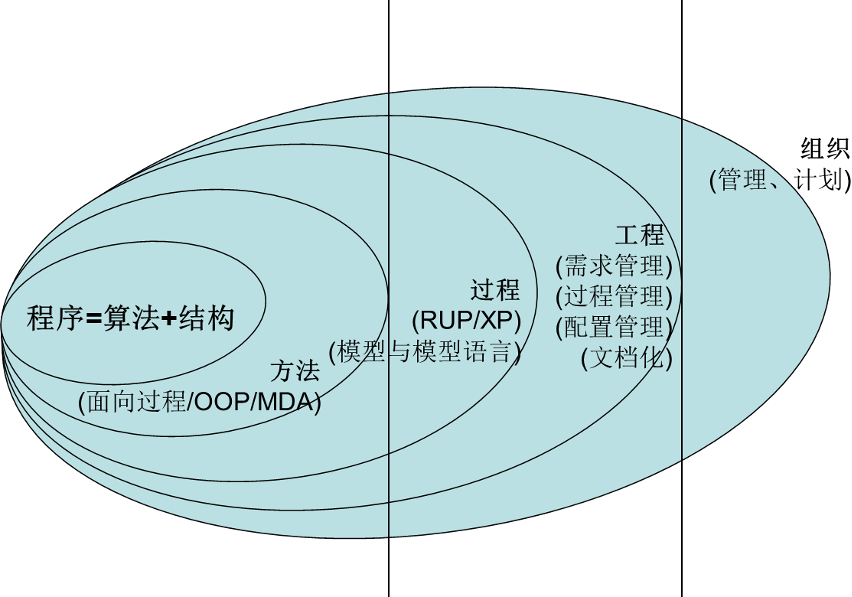
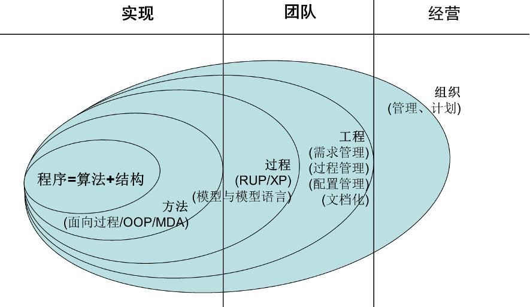
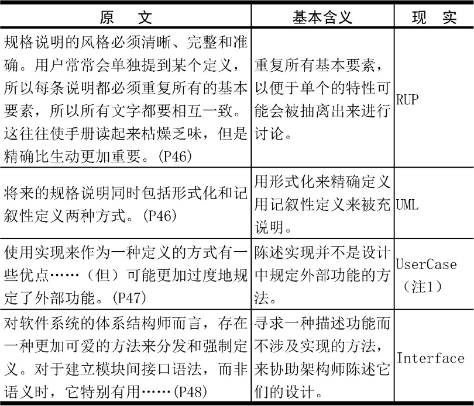
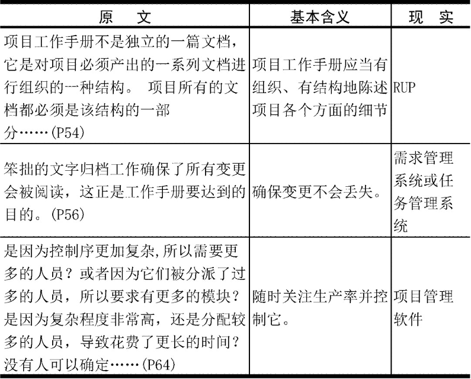

# 内容提要

本书提出了审视软件工程的全新视角和软件工程的 体系模型(EHM，软件工程层状模型)。本书用非工 程的方式重新解析软件工程现象，全面、细致而深 刻地分析了工程中各个环节的由来、价值及其内在 关系，综合论述开发、工程二者的现状。全书语言 轻快，可读性强，薄且有味。

本书作者[周爱民(Aimingoo)](https://aimingoo.github.io/)，本书[豆瓣评分7.3分](https://book.douban.com/subject/4210602/)，书中部分内容来自作者的个人博客，其中第10章，具体工程（讨论具体工程的思想和基本方法），取材自作者博客文章[《杀不死的人狼》系列](https://aimingoo.github.io/1-63.html)，作者博客中对本书[创作背后的一些故事](https://aimingoo.github.io/1-70.html)，也有阐述，感兴趣的同学可以作为背书阅读的课外阅读。

# 编程的精义

> “虽我之死，有子存焉;子又生孙，孙又生子;子又有子，子又有孙。子子孙孙，无穷匮也。而山不加增，何苦而不平?”
>                    ——《愚公移山》，《列子·汤问篇》

编程这件事于广大程序员的世界里，总有着一个高大上的梦：*改变世界*。但是仅仅编程来说，多多少少有点体力活的意思，近年来也多有“码农”的调侃称谓，但是细想也不乏形象，与实际还是有些关联的。

两千年前的以为工程名家，他曾一人集项目组织者、团队经历、编程人员、技术分析师等等角色于一身，开创了一段美丽而有发人深省的佳话传奇，他就是**愚公**。

愚公的寓言故事相信大家都耳熟能详了，那今天就看看愚公如何一步步实现看似不可能的原始需求的。

愚公的原始需求：

> “惩山北之塞，出入之迂”

此项目是谓巨大，但愚公并未退却，于是：

> “聚室而谋曰”

然后，确定了该项目的具体目标：

> “毕力平险，指通豫南，达于汉阴”

通过研讨，择定了一个可实现的技术方案：

> “扣石垦壤，箕畚运于渤海之尾”。

有了这些，该找人来实现了，于是动用了三名技术人员和一名工程管理人员：

> “(愚公)率子孙荷担者三夫”

另还获得了一个力量虽显薄弱，但是满腹工作激情的外协：

> “邻人京城氏之孀妻，有遗男，始龀，跳往助之”。

有了目标、技术方案和参与人员，那整个工程的编程实现该怎么展开呢？“河曲智叟”与愚公的对话，阐述了整个工程的编程实现：

* “虽我之死，有子存焉”，这里描述了可能存在的分支结构，即“IF”条件判断;
* “子又生孙，孙又生子;......子子孙孙，无穷匮也”，这里描述了完成这个工
程所必需的循环结构。

这里循环往复会不会是个死循环，而导致整个项目无穷尽尔？其实不然，愚公论述了这个循环的可行性，即“山不加增”，所以条件“山平”是必然成立的，不会出现往复的轮回。

从愚公的故事中我们看到了编程的根本：**顺序、分支合循环**。无论庞大还是微小的工程，都可通过这样的编程来实现。

另外关于能不能学会写程序这件事，本人也被问到过多次，一直以来的回答便是，只要你想去写，都可以写。因为能问出这样问题的人，应该不是先天条件不足者。

编写程序的第一要务想必大多数人都弄错了，并非上来直接coding，而是先把事情分析清楚，先后逻辑和依赖关系搞明白，必要时还需要画画逻辑关系图等辅助思考，然后再去写代码实现。因此代码实现的并不是程序本身，而是思想，包括使用算法描述逻辑实现，使用结构实现算法所依附的数据实体。

最终程序本身，只有两部分组成**程序 = 算法 + 结构**，

程序的实现用什么语言，通常情况下我们不是在新创，而是在原来工程的基础上进行迭代等，语言的选择没有过多的选择性。但是就语言本身而言，没有好与坏、会与不会的问题，任何语言底层的相似性可能超出你的想象，因为所有的语言最终都依赖于操作系统。语言的差异主要表现在适用范围上，只有对当前项目而言，某种语言更加适合与否罢了。

至此，可能已经大大提高你编写程序的欲望，但是这些都只是蛮荒时期，远古时代无工程思想下的必然产物，有了这些基础，善于钻研和思考的人们，开始造就方法，迈向更加高效文明。

# 懒人造就了方法

> 僰道有蜀王兵蘭，亦有神作大滩江中。其崖崭峻不可破，(冰)乃积薪烧之。”
> ——《华阳国志》

古有愚公**凿山运石**，再有李冰**积薪烧之**，那哪一种算是好的方法呢？仁者见仁智者见智，但这都是在特定条件下的使用方法而已。换个思路，愚公为何不采用**积薪烧之**，而是采用略显笨拙费力的**凿山运石**呢，可能原因是愚公太过勤快了，勤快到今天可以比昨天多凿一倍的石头，而无闲暇时间思考如何更加快速的方法，反观李冰，团队人数众多，他本身肯定是一个闲人，闲到没事去看或是否能够把石头烧爆，无论愚公还是李冰，都处在一个大工程里面，如果一个人闲到去看火烧石头，那他想必不是那么勤快，那不是懒是什么呢？

人的精力总是有限的，提出新的“方法”，解决的将是影响做事成效的根本问题，愚公或许能够多吃饭，多加班，但是突破不了人的精力极限。

> 番外：相传在两千年前的某一天，闲极无聊的李冰下厨给夫人炒了一个 小菜，他突然发现垒灶的鹅卵石被烧得爆裂开来，遇水尤甚。从此 《史记》上就记下了“蜀守冰，凿离堆”，而《华阳国志》上则记下 了他做这件事的方法:积薪烧之。

[打孔带](https://zh.wikipedia.org/wiki/%E6%89%93%E5%AD%94%E5%B8%B6)是早期程序的载体，如果要让计算机去读其上的孔洞逻辑，必然需要连续性的读取，否则织机的运转将陷入走走停停的尴尬境地。

早期的程序都比较小，几千行代码即可完成一个功能，且都存在于一个文件中，那个时期这样的写法司空见惯，也并不会引起什么不适。现代的软件都相对庞大，动辄上万行代码，如果此时还是单纯的写在一个文件中，可能你就要被痛骂或挑战了。为了解决此类问题，人们创造了**单元文件**，也随之出现了一个新的概念：**模块**。大模块细分小模块，小模块再细分为更小的模块，一个模块对应一个单元，于是便可以分工协作，团队作战了。此时**结构化编程**思维开始萌芽。

> 番外：
> “为什么我学了一年的编程，却还是不知道怎么写程序呢?”
> “你桌上的书是乱的吗?”
> “比较整齐。”
> “你既然知道如何把书分类、整整齐齐地放在书桌上，那怎么没想过如何把所学的知识分类、归纳一下，整整齐齐地放在脑子里呢?”

**结构化编程**的基本单位是**过程(Procedure)**，而不是上面说到的**单元(Unit)**。

至此，*程序 = 算法 + 结构* 可能并不直接适用了，它是面向过程时代的必然产物，随着面向对象时代的到来，有了事件驱动和模型驱动，所以有了“方法”的问题，有了方法的调配，程序更加的合理，此时*程序 = 算法 + 结构 + 方法*。

> 原文摘录
> 所谓“面向过程开发”，其实是对“结构化程序设计”在代码阶段的一个 习惯性的说法。而我忽略了这个阶段的“方法”的根本原因，是即使 没有任何“方法”的存在，只需要“单元(Unit)”和“模块(Module)” 的概念，在面向过程时代，一样可以做出任意大型的程序。在那个 时代，“方法”问题并不会像鼻子一样凸显在每一个程序员的面前。
> 在面向过程开发中，“过程(Procedure)”是由 CPU 提供的，“单元 (Unit)”则是编译器提供的(机制)。程序员无须(至少不是必须) 再创造什么“方法”，就可以进行愚公式的开发工作了。

# 团队缺乏的不只是管理

> “言人三为众，虽难尽继，取其功尤高者一人继之，於名为众矣。”
> ——《汉书·高惠高后文功臣表序》颜师古注

我们常说“三人行，必有我师焉。” 那为何是三人行，而不是一人行，二人行呢？《汉书》中说“言人三为众”，是指三个人就算得上是“众”了。这里的“众”应该理解成一个群体，亦或者说是一个团队。

团队至少是以三个人为规模的。这有其合理性。为什么呢？首先一个人算不得团队，那是个体。两个人则互相支撑，古文中“从”字是二人互立，就是这个意思。然而二人互立并不算团队，因为没有监督。三个人便可以构成团队，这样便有了团队的一些基本特性: **主从、监督和责任**。

> 片面地理解成“三人为众”是不对的。“三”在这里是虚词，指的是很多人的意思。然而，古人以“三”来泛 指很多人或者群体，则是很值得玩味的事。

春秋时晋国最高司法长官李离，因为听信属下而判案失误，把一个 不该处死的人错判了死刑。随后“自拘于廷，请死于君”。晋文公打 算追究他属下的过错而免掉他的罪，而李离说:

>   “臣居官为长，不与吏让位;受禄为多，不与下分利。今过听杀 人，傅其罪下吏，非所闻也。”

随后李离就拔剑自杀了。

项目做不成就要掉脑袋，就好比枕着铡刀做程序；如果项目失败就要递交辞呈，那可能就从来不会有项目经理。但是从李离的故事中可以浅层次的发掘，管理者最基本的素质是承担责任。

做项目并非死亡游戏，而是在尽可能的实现某个目标，项目成败往往由两个方面来评估：

* 项目完成的质量
* 项目完成的时间

即项目的交付质量和工期，两者缺一不可。程序员的世界里，对于质量往往相对胸有成竹，多数不会出现大的问题，但是工期的预估却难倒了不知多少英雄汉。

> 作者与一位讲师的对话摘录：
> “什么方法能保证预期的工期是正确的，或者说项目是可以按时完成的。”
> “经验丰富的工程师能尽可能接近地预估工期， 但没有办法保证(预估的)工期是绝对合理的。”

即由于没有绝对合理的工期，所以项目的完成时间可能总是被进度变更所修正，所以项目也就总是不能“成功”。项目工期的问题不能解决，就不能保证项目成功。只有经验更加丰 富，才更有可能逼近“合理的工期”。

汉朝的刘向在《新序•杂事二》中记录了一个故事，说是魏文侯出游，见路人把羊皮统子毛向内皮朝外地反穿着，还背着一篓喂牲口的草。 文侯奇怪地问他为什么。这个人答道:我爱惜这件皮衣，怕毛被磨掉了。文侯叹道:你难道不知道，如果皮被磨尽了，毛不也就掉光了吗?

皮之不存，毛将焉附。没有确定的组织机构，又如何能指望做出来 的管理制度“合用”呢?

制度的建立是为了解决**体制**中**制**的问题，无制不成体，没有制度，无惩戒劣质员工的依据，有了制度而没有惩戒，均属于管理者的过失。对于已经规范管理、体制健全的公司，对于员工的惩戒无可厚非，但是前提至少包括：

* 员工已经接受过相关的培训，至少是员工规范和技术技能的学习;
* 在该员工之前，相同或相关的错误没有被枉纵。

即有人性化的体现，又是公平性的体现。规矩就是规矩，无特殊情况特殊处理，制度一旦被破坏，若要在做杀鸡儆猴状，那猴子是被吓着了，不平声、怨气也就随之而来了。

因此最好的方法是修订制度，而不是不断的修理人。

一般在项目开始时，我们会去确定一个人，附带角色定位。例如开发团队中的项目经理，技术负责人、开发人员等，这样一种三类角色构成的“三人”团队，即存在主从关系，也存在协作关系，但是要注意： **跟随蚂蚁。但不要栽进蚂蚁洞里。**

小的时候，我就喜欢观察蚂蚁。我喜欢看它们成群结队地搬着东西 穿过小路，或者水沟。我尝试用木棍导引它们改变行动的路线，然 而不久之后，它们就会翻过那根木棍，按照既定的路线行进。

禀性难移，要改变一个人都难，何况是改变一个团队的既定习惯。

**团队真的需要管理吗？**

**开发团队并不需要管理，或者说，在没有弄清楚状态前，不要去管它。**

如果有一群开发人员像蚂蚁一样辛勒地工作着，那么，请先不要打 扰他们。你应该跟随他们，看看他们是如何做的。发现规律，分析 这个规律的价值，最后再尝试改变他们(的一些负面价值的规律)。

所以你要紧紧地跟随他们——除了一个地方。那地方是你去不得的，那就是蚂蚁洞。

显然，你不是开发者，你是管理人员。所以尽管你也是团队中的角色，但千万记得离蚂蚁洞远点。你在洞外张望，可以发现问题;你在洞内，就只有做“循规蹈矩”的蚂蚁。 

管理者是那个可以在洞外放木棍的人。

# 流于形式的沟通

> “足下求速化之术，不于其人，乃以访愈，是所谓借听于聋，求道于盲。”
> ——唐·韩愈《答陈生书》

在韩愈的《答陈生书》中，他因自己不会“速化之术”，所以说陈生 是“求道于盲”。然而他用了一个不恰当的比喻:因为盲人并非不知 道路如何走，只是他不能像常人一样描述他所知道的路。因此“问道 于盲”是没有错误的，真正的错误是你睁着眼睛问。

我们需要在正常人与盲人之间建立一种沟通的方式，既然盲人不能 睁开眼睛，那么你就闭上眼睛好了。

大部分程序员回到老家，都可能会面临被问是做什么工作的？而当你回答写代码的、做程序员的等等一些自认为简单明了的回答时，对方却一脸懵，认为你答非所问。其实这样的沟通就是一种流于形式，看似有问有答，但是效果可想而知。就像C语言是程序员与计算机交流的语言，你不能希望客户也学习或精通C语言，这无疑是一种自杀式的行为，反之，客户希望某个项目的文档中“用户手册”让程序员来写，但是写完后，客户却觉得写的内容不契合或不正确等，程序员写了很多，但是却都是技术性的使用，而不是哪些非技术人员使用的内容一样。

另一方面，沟通被复杂化。这个职场中还是能够见到的，某些会议中，开始可能会各种渲染，各种主题思想，但是重要的待沟通事项却最终早早了事，完全没有达到会议的目的，还占用着参会人员的时间。

**应该清楚的是，保障每一次沟通的有效性是最最重要的事。**

> 中国的“五千年文明史”实际上仅有三千年“有史可查”。因为我国古代编年史的上限，只能追溯到《史记•十二诸侯年表》中记载的西周共和元年，亦即公元前 841 年。在 司马迁在写史记时，他面临的许多文献材料就比较模糊，且相互间 不一致，只好弃之而不用。因而，这导致“(夏商周)三代”的年代 无法考证确实，司马迁也只能为其后可考证的年代写出“(十二诸侯 国)年表”。

项目的中断和中止，与历史产生断层的内因是一致的，即无证可查。程序员的世界里，常见的是代码注释，但是代码注释并不是项目历史，而是便于代码阅读，后人理解代码意图等等，项目历史是为整个项目而记录的，例如需求背景、需求阶段的干系人、过程、结果，设计阶段的历史框架变化、结构变化等，开发阶段的技术选型、技术方案、评测以及影响等，有了此类较为完善的记录后，每一个不了解该项目的人看了，都不会无证可查，无据可依了。这也是一种沟通，让整个关于项目的沟通都切实有效，而非各种寻迹。

其实沟通是具有目的性的，如果在没有目的的情况下进行沟通，将是浪费客户和自己的时间，这种目的，在项目中时了解项目的各种信息，挖掘潜在项目或问题，等等等等，最不济，是交流感情。

然而大多数情况下，它仅仅被看成是交流感情。这便成了形式，且 往往是客户所讨厌的一种形式。
沟通问题不仅仅存在于你跟客户的交流之中，还存在于项目的各个 角色之间。设计人员看不懂项目的分析报告，或者开发人员看不懂 设计人员的方案，又或者测试人员看不懂开发的结果，等等，都是 沟通问题。

**流于形式的沟通，可能是使你项目不断推翻和延迟的最直接原因。**

# 失败的过程也是过程

>  “虚有其表耳。”
> ——《明皇实录》

软件工程的概念大概是20世纪60年代提出的，但是其成熟的标志是**瀑布模型**的提出。瀑布模型将软件开发的过程分为需求、分析、设计、开发和测试五个主要阶段，这个过程几乎主导了之后的所有的软件开发工作。在此过程中也演变出了例如RAD（Rapid Application Development, 快速应用开发）模型、螺旋模型和现在常备提及的RUP（Rational Unified Process, Rational统一开发过程）模型。

所谓模型也就是“样子”，过程被描述为可重复的模型，但是实施的结果可能称为相当尴尬的局面。例如著名的秋千的需求陷阱即如此。

秋千需求的陷阱是什么？同样是在执行者每一个开发阶段，但是最终的交付和最初的需求大相径庭，做完了过程中的每一个阶段，并不等于做完了工程，或者工程并不是这样就可以做成功的。

因此无论采用什么模型来做工程，即使是亦步亦趋，也做不好工程。因此，做“过程”并不是做工程的精义，也不是目的。

> 四川有句地方话叫“做过场”，也有说成“走过场”的。“过场”是舞台术 语，意思是角色从舞台一端出场，再走到另一端进场的一个过程。 过场角色一般没有唱腔或道白，即便是有，也是没有什么实质内容 的。

秋千的例子就是一个典型的过场。

究其根本，是忽略了真实的目的 --- 实现。工程只是一种实现的途径，过程也好，方法也罢，无法实现也均是空谈。

身边也有类似的案例，某个项目开始了，一群人勤勤恳恳，折腾了大半年，结果最后项目失败了。但是每个人都做完了工程的每一个过程，最终还是没有完成项目，或项目的每一个“实现目标”。

> “楚人有卖其珠于郑者，为木兰之柜，熏以桂椒，缀以珠玉，饰以 玫瑰，辑以羽翠。郑人买其椟而还其珠。”
> ---- 《韩非子•外储说左上》

在各种模型的驱使下，很多人很是崇拜模型，万事皆上模型。但是却忘记了模型也只是特定场景下的一种解决问题的方式，而非无它不可，若是一定要以模型来定义，瀑布模型可概括一切，哪些一而再、再而三的变体也只是在过程中不断探索和发现的瀑布模型的变体而已，因此决不能以模型定义过程，而是在过程中不断的完善模型，优化模型，制定适合当前项目的模型即可，但是记住模型也不是一蹴而就的。

再着，工程并非是做出来的，就像面包馒头之类，有个模子，拿来照着操作就可以“做”出来。而工程几乎没有一模一样的，环境不同，工程的实施也不尽相同。工程的本质是**组织**，组织工程中的各个角色，大家分工明确，步调一致，共同完成项目。

但是没有常胜，工程有成有败，失败的工程，也能够从其过程中得到很多。

 

东汉时期，伏波将军马援在南征交趾期间写过一封著名的家书，是教导两个“喜讥议，而通轻侠客”的侄儿的，希望他们学习敦厚谨慎的龙伯高，不要仿效豪侠仗义的杜季良。

龙伯高时任山都长，杜季良时任越骑司马，都是马援所“爱之重之” 的人。然而马援告诫两个侄儿说:

> “效伯高不得，犹为谨敕之士，所谓刻鹄不成尚类鹜者也。效季良不得，陷为天下轻薄子，所谓画虎不成反类狗者也。”

于是，伯高、季良因马援家书而名留史册，“刻鹄类鹜”和“画虎类犬” 就此成为典故。这意思便是说，雕刻天鹅不成，总还可以像只鸭子 (鹜);若画虎不成反而像条狗，那就事与愿违，贻人笑柄了。

同样在软件开发中，以得失而论，无论是什么模型应用的失败，都有其所得。例如瀑布模型和RUP模型之间，学习前者不成，可思过程的本质；学习后者而不成，可得文字的架子。

往往越简单的东西，越接近本质。

朱湘说:“画不成的老虎，真像狗;刻不成的鸿鹄，真像鹜吗?不然， 不然。成功了便是虎同鹄，不成功时便都是怪物。”

马援说:“学龙伯高，即使达不到他的水平，总还能成为一个谨慎的 人;而学杜季良，如果学不到家，便会沦为轻薄浪子。”

你到底是选择架子，还是骨子?

# 从编程到工程

> “得其精而忘其粗，在其内而忘其外;见其所见，不见其所不见，视其所视，而遗其所不视。”
> ——《列子·说符》

猿之于为人，“学会制作和使用工具”是最重要的标志。编程语言之所以在软件工程中有着重要的作用，是因为语言是一个工具，学会使用语言、甚至制作语言，将各种项目需要实现，且高效率高质量，才使得语言这个工具变得有意义。

每条纵向的细线用于定义一个关注点。EHM模型不描述工程元素之间的关系，甚至在试图割裂各个元素，以使得工程角色定位以及各自的视角更加清晰明确。

* 在“程序”与“方法”层面，关注与“（具体的）实现”
* 在“过程”和“工程”层面，首要考虑的是团队问题。
  
从角色的角度上来说:开发经理思考项目的实施方案和管理具体的 开发行为，而项目经理则保障团队的稳定性和一致性。

“程序=算法+结构”是最内环，此部分虽然占比较小，但是在整个工程项目中却是最核心的部分，项目的成败也多取决于此。推进实现节点向前发展的是“方法”和“方法论”的出现，历史实践经验积累到一定程度，方法论也就应运而生了，任何人都能提出或总结出一些方法论，只不过时机不尽相同而已。

> 有人在寺院扫了一辈子的落叶而得道，也有人因为一句话而得道。

过程说的是很多的人(团队)如何组织在一起进行开发的问题。它 首先把工程中的环节分解出来。这样，有了环节，就有了角色;有 了角色，就有了沟通。

因此过程中的问题，就是角色、沟通和环节的问题。

哪些环节重要，哪些环节要紧，视具体的项目而定，但是相互协作和角色间的沟通可能是决定项目过程的步调一致。

在工程中，站在“组织者” 这个角色上，你现在要考虑的内容可能会是:

* 为项目的各个阶段建立计划，并逐渐地细化计划的内容，以及确立项目过 程中每一个环节、每一个计划阶段的优先级和复杂度;
* *确立项目或者产品阶段目标，成果的准确描述、定位，以及整个项目的质 量目标及其评核办法;
* 对团队中的不同角色展开培训，以指导并协调角色间的工作，从而消除因 为工作习惯的差异带来的影响;
* 为每一个人准备他所需要的资源，这不单单是把一套 Shareware 变成正式 版或者把 512MB 内存变成 2GB，还包括准确地评估他的工作量，以及决 定是否为他增加一个(能协同工作的)副手;
* 决定在哪些环节上反复审核和回顾，而在哪些环节上采用较为宽松的方式 以加快进度;
* 习惯于开会、组织更短而有效的会议，以及建立激励机制，当然也不要忘 记让每一个成员意识到这一项目的风险;
* 不要乐观。

# 现实中的软件工程

>  “王不如远交而近攻，得寸，则王之寸;得尺，亦王之尺也。”
>   ——《战国策.秦策》

大公司们在标准、理论、语言上的争来夺去，未必全然出于“软件实现”的考虑。对统一理论、统一工具、统一过程的企图，其最终目的是在整个软件工程体系中的全面胜出。

因而，除了软件本质力量的推动之外，商业因素也推动着软件工程 体系的发展。大公司们的争夺战的最终结果，已经开始把软件工程， 从原始的“自身演进”状态，逐渐推进到“他激发展”的状态上了。

这种他激发展可能会影响到软件工程发展的速度，而不会影响到各 个工程层面上的“关注点”。

蚂蚁的团队总是被本能地组织得非常好。然而如果一个蚂蚁的群体 中有了流行疾病，蚂蚁在死去，而新生蚂蚁不能跟上其死亡的速度， 那么很快，这个团队就溃散了。

这是因为蚂蚁用于维护团队运作的“资本”在流失。如果资本没有了， 就没了运作，团队的存在就没有了必要性和可能性。

* AOP、OOP等只是一种方法论，支撑着编程实现的思想，而C、C++等是语言，是编程思想的一个实现工具
* MDA(Model Driven Architecture)是驱动开发的统称，包括但不限于TDD（测试驱动开发）、BDD（领域驱动开发）等等，以什么驱动开发只是一个以哪个环节为中心或导向的问题。

# 具体工程

> “齐人就赵学瑟，因之先调，胶柱而归。三年不成一曲，齐人怪之。”
> ——邯郸淳《笑林·胶柱鼓瑟》

* 脱离本质的答案可能不是正确的。
* 现象之存在与是否被发现无关。
* 本质是严谨的，而现象和答案千变万化。

若无银弹，人狼或许杀不死。银弹可比各种工程思想，技术思维，方法论，工具等等；人狼好比庞大的工程，其有一定的复杂度、一致性、可变性和不可见性：

* **要面对极端的复杂性。**尽管我们可以用模件复用来缓解复杂性，但是软件 实体的扩展必须是不同元素实体的添加，这些元素“以非线性递增的方式交 互，因此整个软件的复杂度以更大的非线性级数增长”。 所以你创建一个新 软件就必然面临更多的(非线性级数增长的)旧软件中不能被复用的元素。 所以在复杂性方面，人狼是自疗系的:越做越复杂，不可能变简单。
* **要背上不可丢弃的历史包袱**。由于 Brooks 强调新的软件需要保证跟旧的 软件兼容(有点象 MS Vista 兼容 MS DOS)，你创生了一个软件也就创生 了下一个软件的需求，所有的创生活动产生了需求的自增集合，尽管这种 “变体不是必需的”，但它一个不可丢弃的历史包袱。所以在保证一致性这 一方面，人狼是自增长的。
* **要接受需求的持续变更。**软件要保证设计一致性才能成功，但从这个软件 被设计的那一刻开始，你就必须接受来自它人的、自身的、市场的、自然 及社会规律的，以及不同的文化和思想习惯的差异的需求(这意味着每个 人的想法都可能被作用在一个软件实体上)。需求是无度和不可控的，所 以人狼本身又是变形系的。
* **不可见。**你找不到足够的抽象方法描述软件的不同侧面，也就不能将它们 表达为抽象概念上的图形。如果你找到了这样的方法，那么这个“软件”本 身就不足够复杂，因此也就不是原本含义上的“根本任务”。所以，它是隐 形的，你如果看见了它，要么是看见了诸多复杂的方面中的一面，要么根 本就是看错了。

而银弹可能有、没有，或者未来一定会有。

不要去相信“它适合于所有的工程”，因为你可能在消耗你的资源
(时间、人力与金钱)去适应一种方法。你:
* 一方面要花销资源去组织、实践和推动这些工程方法
* 另一方面工程的规模可能根本没有资源去推动它们

所以你必然面临失败;如果你:

* 增加资源去推动，那么成本可能大于项目利润
* 你的老板会不乐意而直接中止这个项目

你还是失败。

所以问题出在你启动这个工程的最早阶段:你认清目标并决定用什 么方法来驱动这个工程。

**在广义工程与狭义工程(或言之具体工程)中，主要目标与次要目 标正好是倒置的。**

作者对“广义工程”的定义是: 

* 面向“软件活动的根本任务”;
* 程序实现的过程无助于求解根本任务。

而对“狭义工程”的定义是:

* 面向“具体工程活动的需求”:实现;
* 将“实现”作为一个过程或结果，则求解“根本任务”只是其探索活动或附加价 值。

> 曾经，我们如同走在一片沙漠，我们看不到沙漠的边缘，也不知道 如何行走。Brooks 的伟大贡献，在于他用《人月神话》指出了一条 道路并教给我们基本的行走方法，让我们从中学会了辨识流沙，懂 得了沙暴的征兆;同时“没有银弹”的假设激发了我们的斗志，如同 有人在说“你要证明沙漠有边界，你就拿出一束青草来看看”。
> 
> 于是有了两种喋喋不休于“有没有青草”的人。一种是已经在灵魂上 上升到另一个层次，固而无需行走于沙漠。另一种则只是站在沙盘 边上，用长杆推动卒子，而鞋子上根本不会沾上一点点沙土。
> 
> 还有一种人则不时地宣传他们已经找到了青草。他们总能确保在你 付费的时候看到青草，转身时才会发现那里并不是沙漠的边缘。
> 
> 剩下的人一边喃喃着“沙漠边缘的青草”，一边在焦燥的沙海里缓步 前行。不同的是喃喃而不自觉者掉进了沙坑，心怀憧憬而盯紧脚步 的人走出了沙漠。
> 
> 走出来，你才会觉得:原来有没有青草，并不那么重要。

# 思考还是思想

>  “此郎亦管中窥豹，时见一斑。”
> ——《晋书·王献之传》

软件工程的三个要素：

* 工具
* 方法
* 过程

三者你中有我，我中有你，相辅相成，如能够每一个“管件”拼合起来，才能得到的是“豹”，而非一“斑”。

而工程整体问题的本质，永远是“实现”。无论从那个角度来看，实现是保证一个工程推进，迭代，成功的关键，每个过程中，都有其工具、每个工具都有其方法、每个方法都有其实施过程等。

软件项目的平衡三角：

* 时间
* 资源
* 功能

经典教材中总是关注：如何更快地完成项目，并减少资源占用，以及实现更多的功能。

然而，及时平衡了这种关系，项目的结果仍可能产生一个天生的残障 --- 质量。

质量的保证是在过程中控制的，目标可能是在不断平衡三角中确立的。

对于现代软件工程而言，整个软件工程的过程大多是非常灵活的，而非古诗词一定是“逐字论平仄”的，变化或变通，是常见的事。

> “古人做词的变格，势必依音律而为之，舍周邦彦、东坡、辛弃疾 此等人物，轻易变格，是为他人所笑话的。所以，词谱中所录变格既少，且俱为名家所创。”

“未蕴而变，自欺也。知 律而变，智者之道也”，实为良言。变向不变求。不变者，万变之所 源，亦万变之所归。习诗词之法度，若蚕虫之结茧，若无结茧于前， 何有破茧于后?故，知律而变，智者之道也。

“知律而变”中的“律”字，若解释作“规律”，那么便是可以用于软件工 程中的了。“道”是规律，如果明“道”，而可以变化无穷，这样做软件 工程才是活的。就如同今人难于填词一样，不明道，则不明智，不 明智则无所以为，因而在软件工程实施中不可避免的盲目与停滞。

“知律”的另一层意思，是在于“知道原理”。明白“为什么要这样”或者 “为什么不是那样”。这在软件开发中是常见的问题，大多数人不知 究竟地使用着技巧和方法，而一旦出了问题，则归究于这些技巧和 方法的不好。而真正的问题在于，这些人(我们通常叫做 Copy&Paster)并不知道这些技巧、技术和方法的原理，因而不知道 变通，也不知道回避错误。

# 作者荐书

* [软件工程](https://book.douban.com/subject/6047742/)Roger S.Pressman 著
